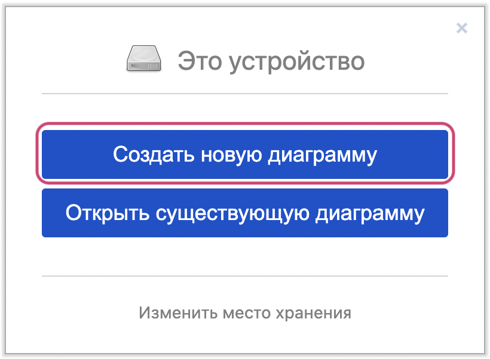
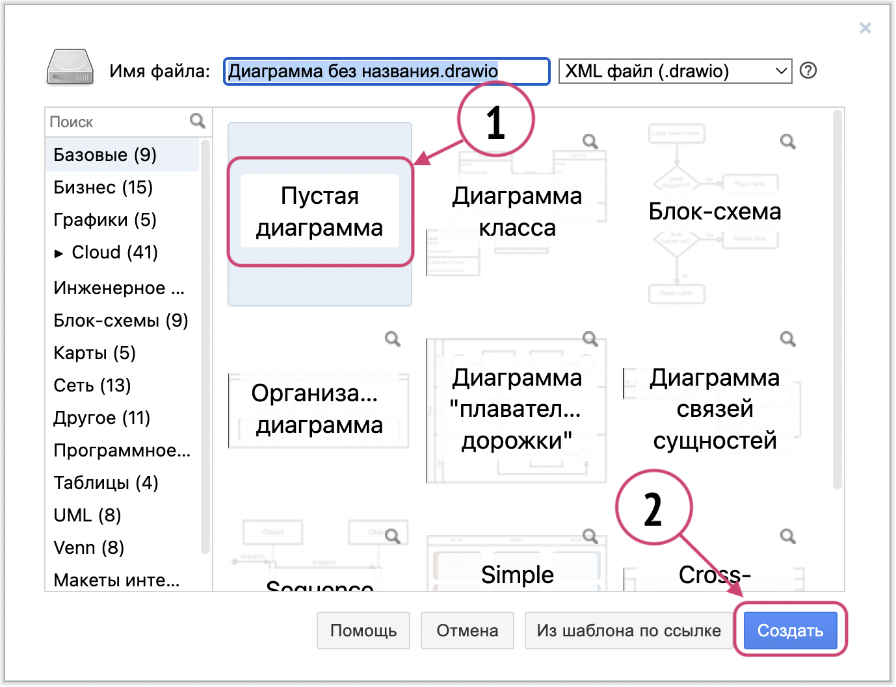
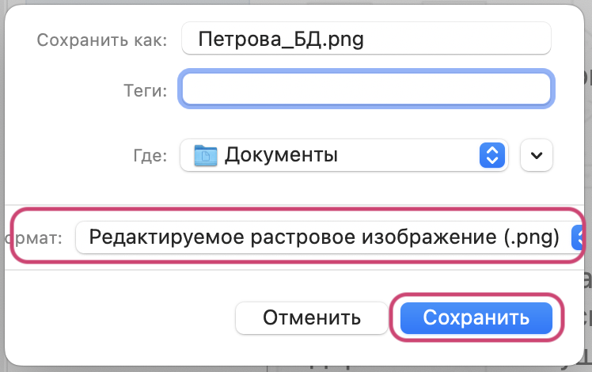
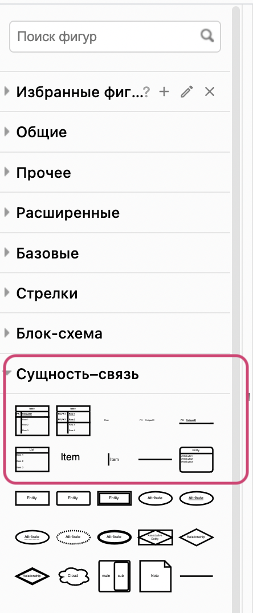
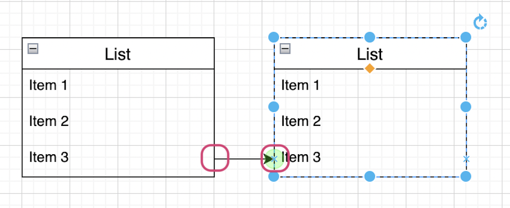
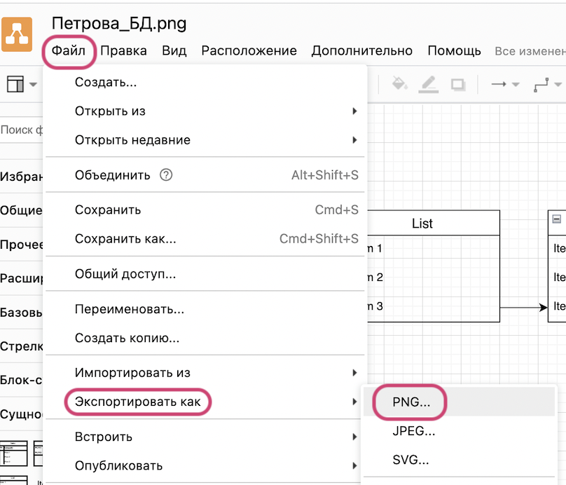
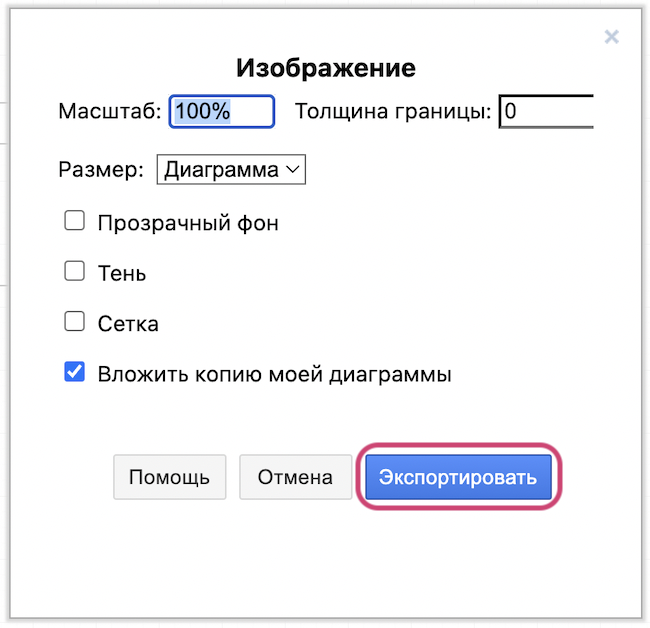
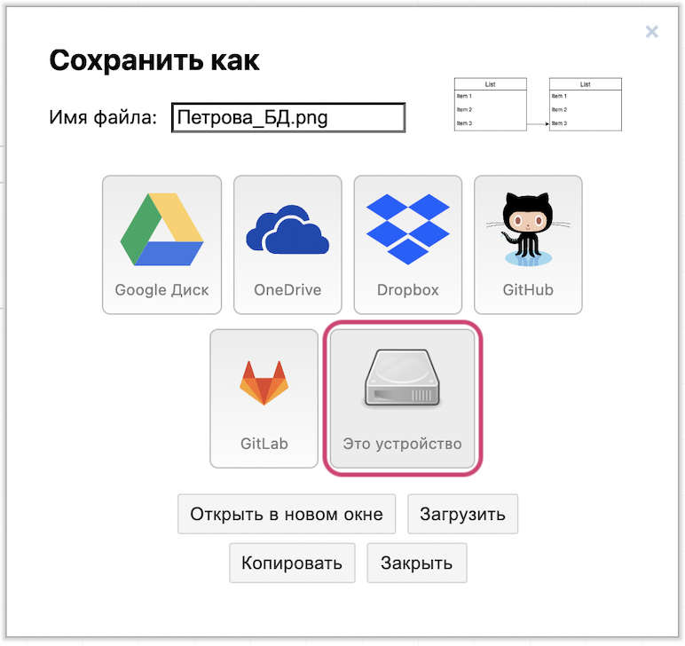

# Инструкция по созданию схем БД на платформе app.diagrams.net

##### 1. Перейдите на сайт https://app.diagrams.net/

##### 2. Выберите в качестве хранилища диаграмм своё устройство

##### 3. Создайте новую диаграмму

##### 4. Выберите пустой шаблон и нажмите кнопку “Create”

##### 5. В палитре блоков выберите раздел “Entity Relation” и добавьте необходимые элементы

##### 6. Чтобы установить связи между элементами, наведите мышку на точку начала линии (зеленый круг) и потяните до места соединения

##### 7. Чтобы сохранить изображение в формате PNG, выполните следующие действия:

##### 8. В открывшемся окне выберите “Export”

##### 9. Переименуйте файл и сохраните получившееся изображение на компьютер

