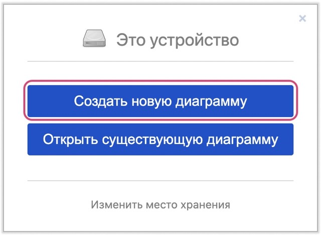
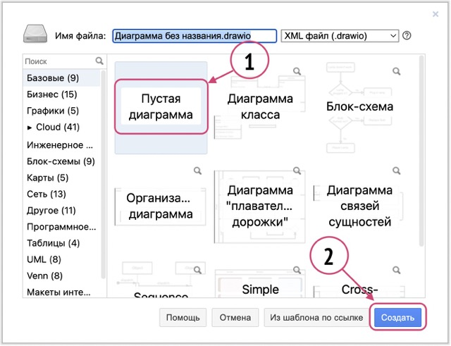
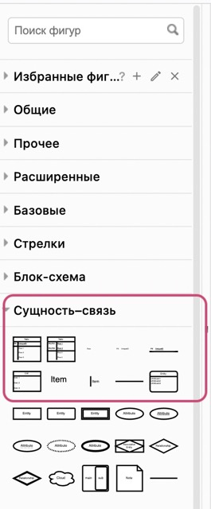
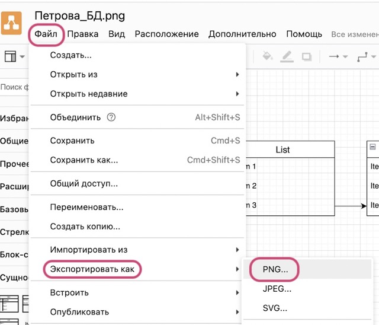
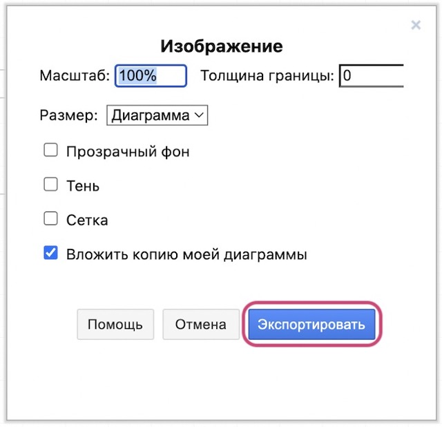
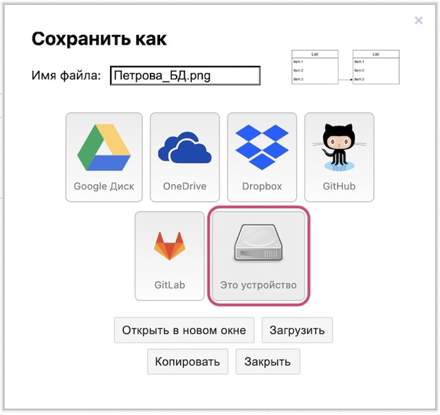

# Инструкция по созданию схем БД на платформе app.diagrams.net

#### 1. Перейдите на сайт https://app.diagrams.net/.

#### 2. Выберите в качестве хранилища диаграмм своё устройство.

#### 3. Создайте новую диаграмму.

#### 4. Выберите пустой шаблон и нажмите кнопку «Создать».

#### 5.Выберите формат .png и нажмите «Сохранить», впишите название файла в первом поле по желанию.

#### 6. В палитре блоков выберите раздел «Сущность-cвязь» и добавьте необходимые элементы.

#### 7. Чтобы установить связи между элементами, наведите мышку на точку начала стрелки и потяните до места соединения (зелёный круг).

#### 8. Чтобы сохранить изображение в формате .png, выполните следующие действия:

#### 9. В открывшемся окне нажмите «Экспортировать»

#### 10. Выберите «Это устройство» для сохранения, файл снова можно переименовывать по желанию.

